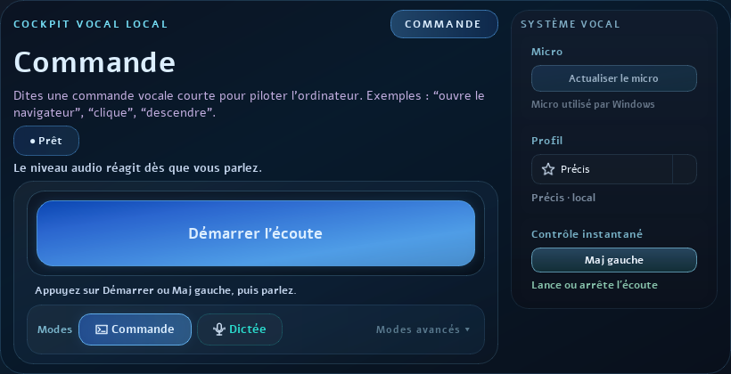

# Voxirys

Assistant vocal local pour Windows : dictee vocale, commandes Windows a la voix, souris vocale et aide d'accessibilite, avec un objectif simple : garder la voix et les textes dictes sur l'ordinateur.

[Site officiel](https://voxirys.fr/) | [Telecharger Voxirys](https://voxirys.fr/download.html) | [Notes de version](docs/RELEASE_NOTES.md)



## Telechargement Windows

Version actuelle : `0.1 beta` pour Windows 10/11.

- Setup recommande : https://github.com/jossmair/Voxirys/raw/main/telechargements/Voxirys-Setup-0.1-beta-20260606_143947.exe
- Version portable : https://github.com/jossmair/Voxirys/raw/main/telechargements/Voxirys-Portable-0.1.zip
- Empreintes SHA-256 : [CHECKSUMS.txt](CHECKSUMS.txt)

Le setup et l'archive portable sont volumineux, car Voxirys embarque les elements necessaires au fonctionnement local.

## Pourquoi Voxirys

Voxirys vise les personnes qui veulent utiliser la voix pour ecrire ou piloter Windows sans dependre d'un service cloud obligatoire.

- Dicter du texte dans les outils du quotidien.
- Lancer des commandes vocales simples.
- Utiliser la souris a la voix pour cliquer et interagir.
- Reduire la fatigue clavier-souris.
- Tester une approche locale pour des contextes sensibles : accessibilite, enseignement, sante, travail administratif.

## Confidentialite locale

Voxirys est concu pour privilegier un fonctionnement local : voix, commandes et textes dictes restent sur la machine. L'objectif est de limiter l'exposition de donnees personnelles, professionnelles ou medicales.

Voir aussi : [docs/CONFIDENTIALITE.md](docs/CONFIDENTIALITE.md)

## Demarrage rapide

1. Telechargez le setup Windows.
2. Lancez l'installation.
3. Ouvrez Voxirys.
4. Verifiez le micro.
5. Utilisez le mode `Dictee` pour ecrire ou le mode `Commande` pour agir.

Guide : [docs/INSTALLATION.md](docs/INSTALLATION.md)

## Etat du projet

Voxirys est en beta. Les retours utiles sont les bienvenus : installation, micro, performance, reconnaissance vocale, accessibilite, ergonomie et cas metier.

Pour aider le projet a sortir de l'invisibilite :

- telechargez la beta depuis le site officiel ;
- ajoutez une etoile au depot si le projet vous interesse ;
- partagez le lien https://voxirys.fr/ avec les personnes qui cherchent une dictee vocale locale pour Windows ;
- ouvrez une issue avec votre contexte d'usage.

## Validation

Commandes de validation utilisees pendant le developpement :

```bash
pytest -q
python tools/run_quality_audits.py --root . --strict
python Voxirys.py --self-test
```

Avant une release publique plus large, le setup Windows doit etre signe proprement et valide sur machine propre.
